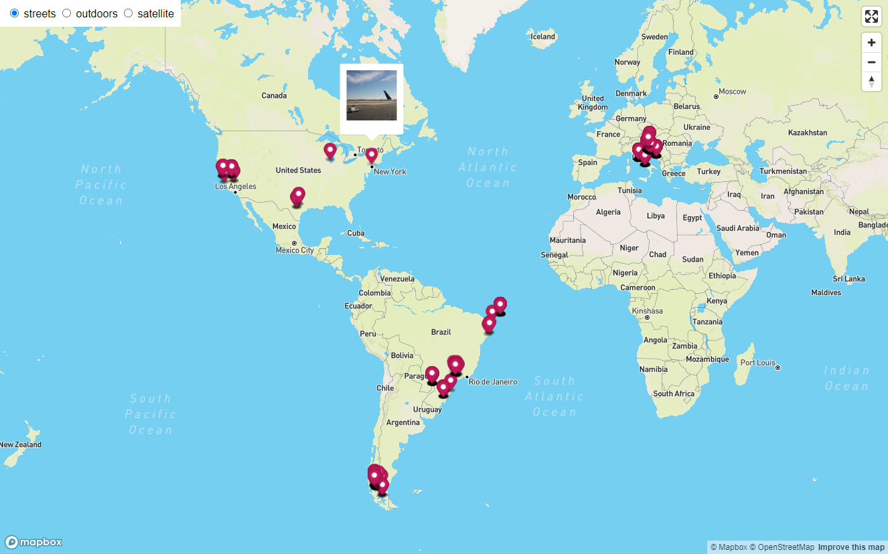
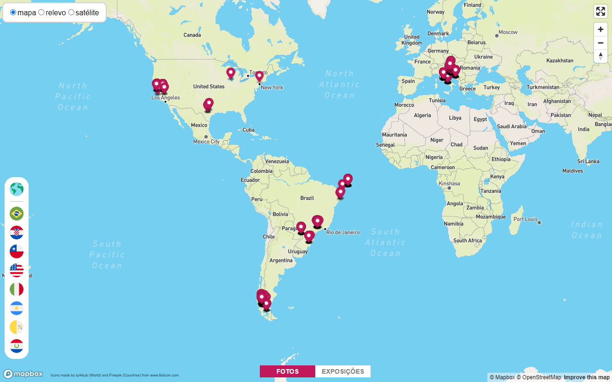

# Flickr Map

This script generates a map with markers for all photos in a user's Flickr™ photostream.

The script was developed to run on _Linux_ systems with _Python 3.x_ installed and it uses *[Flickr](https://www.flickr.com/)™* and *[Mapbox](https://www.mapbox.com/)™* APIs. See the [GitHub repository](https://github.com/HaraldoFilho/flickr-map) for detailed instructions on how to install, configure and use the script. It is also possible to customize the map, adding elements like the one below, where a country selector was added in the left size and a map selector on the bottom:

In the [GitHub repository](https://github.com/HaraldoFilho/flickr-map) there are also instructions on how to do this.
